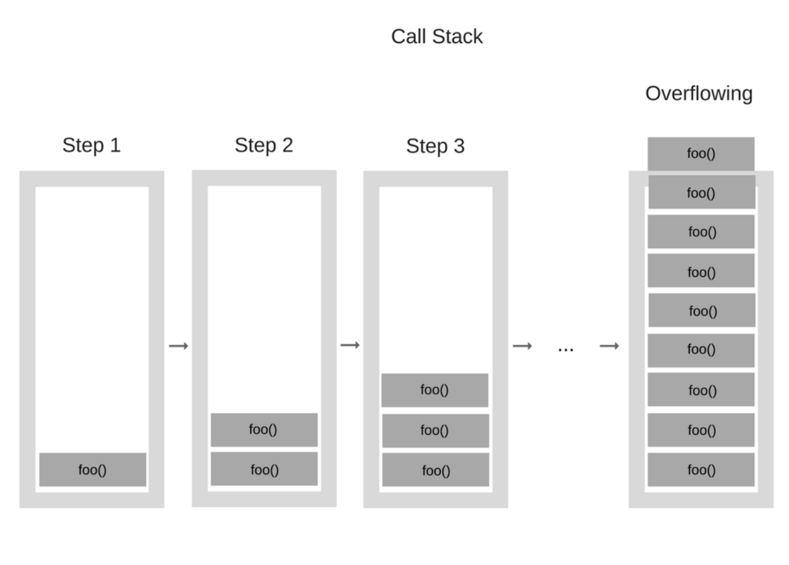

---
tags:
 - js engine
 - event loop
 - memory leak
 - stack overflow
---

# JS 運行原理：JavaScript Engine

<Tags :tags="$page.frontmatter.tags" />

> JavaScript 引擎是一個專門處理 JavaScript 指令碼的虛擬機器，一般會附帶在網頁瀏覽器之中。
> -- [Wikipedia](https://zh.wikipedia.org/wiki/JavaScript%E5%BC%95%E6%93%8E)

各個瀏覽器會有不一樣的 engine，如 Chrome 使用 V8 engine，各自有各自執行並優化 JS 的方法。


這張 JS Engine 總覽圖可以拆解成三個部分：`Memory heap & Call stack` + `Web APIs` + `Callback queue & Event loop`

## Memory heap & Call stack

JS engine 執行 js 程式碼時會產生兩部分 `Memory heap` & `Call stack`：

### Memory heap
宣告變數的時候會一一存放在記憶體裡，雖然 JS 有垃圾回收 (Barbage collection) 機制，但此機制並不是萬無一失[*見參考]，如果有太多記憶體位置沒被妥善釋放、回收，就會造成 `memory leak`，這也是為什麼應避免使用 global variables。

參考：[記憶體管理 - 回收機制章節](https://developer.mozilla.org/zh-TW/docs/Web/JavaScript/Memory_Management)

### Call stack 
執行 function 的時候會把此項「任務」放進 call stack 裡，stack 此資料結構的特性是**後進先出**，倘若一個 function 一直呼叫自己 (resursion) 導致 stack 不斷往上堆疊，或是一個沒有停止條件的無限迴圈，都會導致 `stack overflow`。

例一：執行 function 的分解動作
```jsx
function printSquare(x) {
  const s = multiply(x, x);
  console.log(s);
  return s;
}

function multiply(x, y) {
  return x * y;
}

printSquare(5);
```


例二：不停呼叫自己的 Recursion

```jsx
function foo() {
  foo();
}

foo();
```



不停呼叫自己的過程同時也把任務一直往 call stack 裡面塞，一直沒有處理結果 return 導致最後 `stack overflow`。

## Web APIs
各家瀏覽器提供了其他操作方法，稱作 `Web APIs`，常見的有以下：
  - console
  - DOM(Document) - addEventListener etc.
  - Window - setTimeout, setInterval
  - AJAX - FetchAPI or XMLHttpRequest
  - Graph - SVG, canvas, WebGL
  - Media - `<video>` or `<audio>`

參考：[MDN Web APIs](https://developer.mozilla.org/zh-TW/docs/Web/API)

## Callback queue & Event loop

::: tip Callback 是什麼？

舉個例子，假如你有一個問題要問老師，在通常的情形下老師會馬上回覆你，但某次可能因為你的訊息量太大或是老師有其他事情要忙，所以你沒辦法當下就得到答案。

你並不知道老師要多久才會回覆，而你卻為了等這個回覆就把接下來要做的事情都 pending，這豈不是太沒效率了？所以你就先把問題發給老師，並請他確認後回覆你，在這之前你就先去做其他事情。

而他處理完你的問題並且 call you back，這就叫 `callback`。

之所以會需要 callback，是因為 JS 是**單線程語言 (single threaded language)**。假如沒有這個機制，並且有一個 function 要跑完需要好幾秒，對瀏覽器來說在執行完這個 function 之前它什麼都不能做，進而造成 block render。

因此 JS 的解法就是用非同步 (asynchronous) callback 來解決這樣的問題，讓你在老師回覆你前去做其他事情，在他回覆你後再去做相關後續動作。

:::

回到主題，當有 callback function 需要執行時，會先進到 callback queue，而 event loop 這個角色則是持續檢查 call stack 的狀態，等 call stack 為空時再將 callback function 丟進 call stack 執行。

Queue 的特性不同於 stack，是**先進先出**，所以先進到 queue 的 function 會先被處理。

## setTimeout 的背後發生什麼事

```jsx
setTimeout(callback, ms)
```

流程：
1. `setTimeout` 進到 call stack
2. Web API 建立 timer
3. call stack 的 `setTimeout` 移出
4. timer 倒數完，把要執行的 callback function 交給 callback queue
5. event loop 監控 call stack 為空
6. 按照 queue 順序將 callback function 交給 call stack
7. 在 call stack 中執行該 callback function
8. 執行完畢，call stack 中的 callback function 移出

### 延伸情境

```jsx
console.log('1');
setTimeout(() => { console.log('2') }, 0);
console.log('3');

// What's the output?
```

答案是：`'1'` `'3'` `'2'`。

因為在 callback function 進到 callback queue 時，event loop 發現 call stack 還在執行 `console.log('3')` 所以暫緩執行 callback，直到 `console.log('3')` 從 call stack 移出之後，event loop 才會把 callback function 從 callback queue 放回 call stack 做執行。

補充：[將執行過程影像化](http://latentflip.com/loupe/?code=JC5vbignYnV0dG9uJywgJ2NsaWNrJywgZnVuY3Rpb24gb25DbGljaygpIHsKICAgIHNldFRpbWVvdXQoZnVuY3Rpb24gdGltZXIoKSB7CiAgICAgICAgY29uc29sZS5sb2coJ1lvdSBjbGlja2VkIHRoZSBidXR0b24hJyk7ICAgIAogICAgfSwgMjAwMCk7Cn0pOwoKY29uc29sZS5sb2coIkhpISIpOwoKc2V0VGltZW91dChmdW5jdGlvbiB0aW1lb3V0KCkgewogICAgY29uc29sZS5sb2coIkNsaWNrIHRoZSBidXR0b24hIik7Cn0sIDUwMDApOwoKY29uc29sZS5sb2coIldlbGNvbWUgdG8gbG91cGUuIik7!!!PGJ1dHRvbj5DbGljayBtZSE8L2J1dHRvbj4%3D)

## 題外話：單線程怕卡住所以有非同步，那多線程呢？

當多個執行緒互相等待共享資源時，就會產生 `deadlock`。白話例子：

1. 一個聚會邀約，A 說 B 去他才去，B 說 A 去他才去
2. 總共只有一刀一叉，A 跟 B 都要同時拿刀跟叉才能用餐，A 現在只有刀，B 現在只有叉，互相都在等待對方用完釋出


## 參考文章

1. [How JavaScript works: an overview of the engine, the runtime, and the call stack](https://blog.sessionstack.com/how-does-javascript-actually-work-part-1-b0bacc073cf)

<CustomVssue :title="$page.title" />